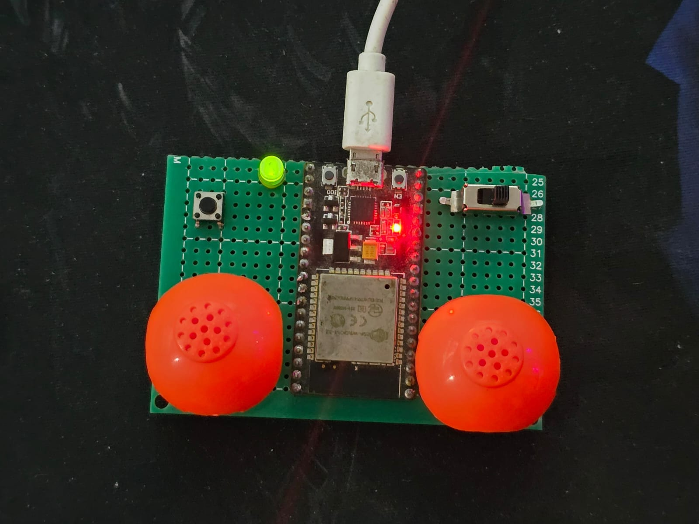
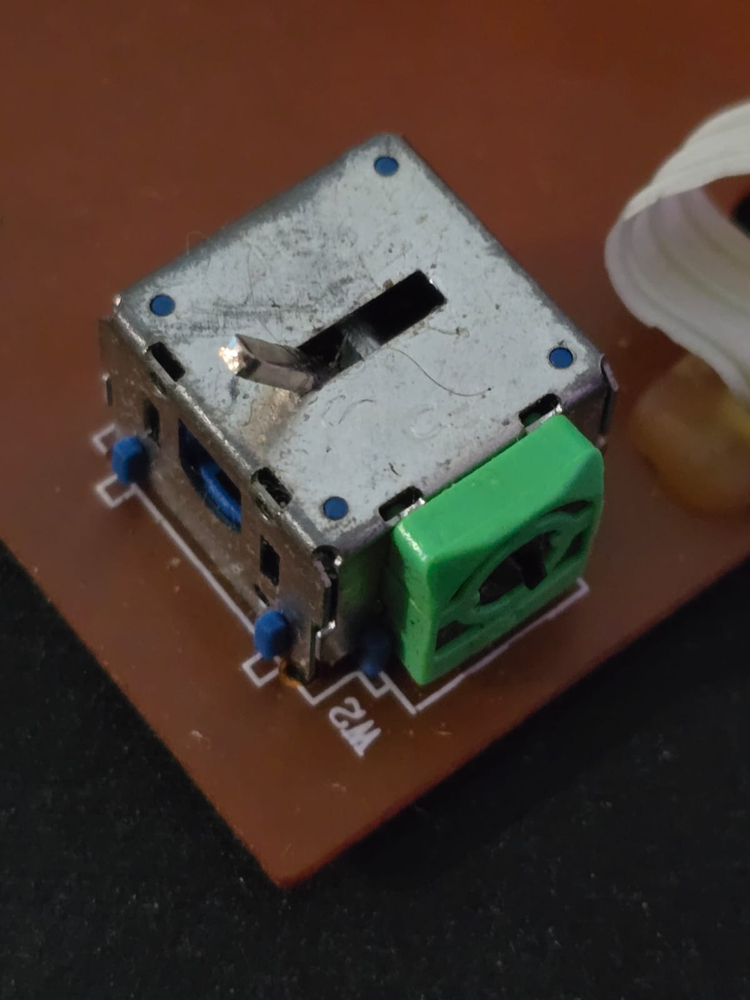

# ESPSHELL

**ESPSHELL** es un controlador BLE basado en ESP32 diseñado para manejar los autos bluetooth de SHELL

---
## 🛠 Imagenes




---


## 🛠 Características

- Control preciso de movimiento: adelante, atrás, izquierda, derecha.
- Modo turbo activable/desactivable mediante un botón.
- Reconexión automática al dispositivo BLE cuando no se encuentra disponible.
- Indicador LED para el estado de la conexión BLE.

---

## 🔧 Requisitos de Hardware

1. **ESP32** (cualquier modelo con BLE).
2. Dos potenciómetros o joysticks analógicos.
3. Un botón para el modo turbo.
4. Un LED con resistencia de 330Ω o 1kΩ.

---

## 📌 Pinout

| Componente        | Pin del ESP32       | Descripción                                |
|-------------------|---------------------|--------------------------------------------|
| **Joystick Move** | `GPIO36 (VP)`       | Control de movimiento (adelante/atrás).    |
| **Joystick Turn** | `GPIO39 (VN)`       | Control de giro (izquierda/derecha).       |
| **Botón Turbo**   | `GPIO33`            | Activa/desactiva el modo turbo.            |
| **LED Conexión**  | `GPIO25`            | Indica el estado de conexión BLE.          |

---

## ⚡ Conexiones Eléctricas

### Joysticks
1. Conecta el pin **VCC** de ambos joysticks a **3.3V** del ESP32.
2. Conecta el pin **GND** de ambos joysticks al **GND** del ESP32.
3. Conecta el eje de movimiento del joystick a **GPIO36 (VP)**.
4. Conecta el eje de giro del joystick a **GPIO39 (VN)**.

### Botón Turbo
1. Conecta un pin del botón al **GPIO33**.
2. Conecta el otro pin del botón a **GND**.

### LED Conexión
1. Conecta el ánodo del LED a **GPIO25** a través de una resistencia de 330Ω o 1kΩ.
2. Conecta el cátodo del LED a **GND**.

---

## 🚀 Instalación y Configuración

### Software Requerido
- **IDE de Arduino** (o **PlatformIO** en VS Code).
- Librería `ESP32 BLE Arduino`. Para instalar:
  1. Ve al **Gestor de Librerías** en el IDE de Arduino.
  2. Busca `ESP32 BLE Arduino` e instálala.

### Carga del Código
1. Clona este repositorio:
   ```bash
   git clone https://github.com/tu_usuario/ESPSHELL.git
   ```
2. Abre el archivo en el IDE de Arduino.
3. Configura el entorno:
   - Selecciona la placa: **ESP32 Dev Module**.
   - Configura el puerto COM correspondiente.
4. Carga el código al ESP32.

---

## 🕹 Uso

1. **Encendido y conexión:**
   - Enciende el ESP32.
   - El LED indicador se encenderá al conectarse exitosamente al dispositivo BLE.

2. **Control del dispositivo remoto:**
   - Usa el joystick de movimiento (`GPIO36`) para manejar hacia adelante y atrás.
   - Usa el joystick de giro (`GPIO39`) para manejar hacia la izquierda y derecha.

3. **Modo Turbo:**
   - Pulsa el botón conectado a `GPIO33` para alternar entre el modo turbo activado y desactivado.
   - El modo turbo aumenta la velocidad de los comandos de movimiento.

---

## ⚙ Ajustes Personalizables

### Zona Muerta del Joystick
Para modificar la sensibilidad del joystick, ajusta el valor de `deadZone` en el código:
```cpp
const int deadZone = 800; // Ajusta este valor según tus necesidades
```

### Reconexión Automática
El sistema buscará continuamente dispositivos BLE si pierde la conexión. Este comportamiento puede ser ajustado en el bucle principal del programa.

---

## 📚 Referencias Técnicas

- **ESP32 BLE Arduino**: [Documentación Oficial](https://github.com/espressif/arduino-esp32/tree/master/libraries/BLE).
- **Pinout ESP32**: [Referencia Completa](https://randomnerdtutorials.com/esp32-pinout-reference-gpios/).

---

## 📝 Licencia

Este proyecto es de código abierto y se encuentra bajo la licencia **MIT**. Puedes usarlo, modificarlo y distribuirlo libremente.

---

